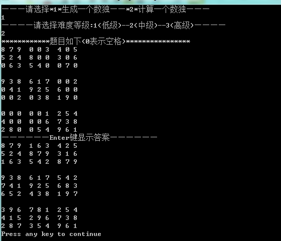

# 数独游戏

### 目标

写一个数独游戏，有以下功能：

1：能随机产生题目并给出答案。

2：求解输入的题目并输出答案。

### 实现说明

参照百度百科等资料可以知道求解数独的主要算法是：1.通过行、列和宫格确定可填数字。2.所有可行数字逐一填入得到结果。本程序求解数独部分也采用这样的算法。而生成题目的算法是：

1. 随机产生一个长度为9的一维数组，元素是随机产生的1到9的不同数字。

比如为root  = [1, 4, 3, 5, 6 ,7, 8 ,9, 2].

1. 先获得一个填满的九宫格accord。
2. 假如九宫格accord的第一行为[6, 4, 5, 7, 3, 9, 8, 1, 2], 则可获得的九宫格squa的第一行第一列元素这样产生：看accord对应元素为6，则看root中6后一位的数为7，则所求数字为7。以此类推。
3. 根据难度随机去除一定数量的空格则得到了随机产生的数独题目。

下面介绍本程序的主要难点和创新点：

1. 解数独的递归法。首先要定义一个检查函数judge用于判断某个数字在某个位置是否合适，进而根据找到的递归头即至最后一个位置后，分是否为0两种情况，否则，继续递归。

2. 随机产生1到9之间的数。由于编译器自带函数rand会出现元素不变的确点，所以使用系统时间为种子，并引入全局变量index，使得时间差加大，避免固定不变。

3. 定义各种函数简化程序。本程序定义了fprintf用于打印九宫格，定义reRank来获取元素在数组中位置等，简化了程序。

   ​

   ​

### 结果

下面是分别选择1(产生题目)和2(计算数独)后的结果图：




### 代码:

语言: C

```
//期末实验报告-简单的数独计算器
#include <stdio.h>
#include <stdlib.h>
#include <time.h> 
long index = 0;    //全局变量index是保证每次产生的随机元素随机性
void main()
{
    void solve(int squa[9][9], int num); 
    void fprintf(int squa[9][9]);
    int reRank(int root[9], int numb);
    int myRand(int range);
    int squa[9][9], accord[9][9]={   //定义用于生成数独的参照数组
        {6, 4, 5, 7, 3, 9, 8, 1, 2},
        {2, 1, 8, 6, 4, 5, 9, 7, 3},
        {7, 3, 9, 2, 8, 1, 6, 4, 5},
        {5, 9, 6, 3, 7, 4, 2, 8, 1},
        {4, 8, 7, 5, 1, 2, 3, 6, 9},
        {3, 2, 1, 8, 9, 6, 7, 5, 4},
        {9, 5, 3, 4, 6, 7, 1, 2, 8},
        {8, 7, 2, 1, 5, 3, 4, 9, 6},
        {1, 6, 4, 9, 2, 8, 5, 3, 7}
        };
    int root[9], answ[9][9]; //定义用于生成数组的一维数组和临时数组
    int i, j, k, p = 0;
    int row;
    int choose, rtemp, diff; //分别定义选择变量，难度
    char result;
    printf("———请选择*1*生成一个数独——*2*计算一个数独———\n");
    scanf("%d", &choose);
//**************选择1生成一个填好的数独****************************
    //根据生成数独题目算法先存入一个数独
    if(1 == choose)
    { //产生范围为1-9的一维数组root
      for(i = 0; i < 9; i++)
      {
          root[i] = myRand(9);
      }
      for(i = 0; i < 9; i++)
      {
            for(j = 0; j < i; j++)
            {
                if(root[i]==root[j]) //使root中元素各不相同
                root[i] = myRand(9);
            }
      }
      //随机产生完整九宫格
      for(i=0;i<9;i++)
      {
         for(j=0;j<9;j++)
         {
            row = reRank(root,accord[i][j]);
            squa[i][j] = root[(row+1)%9];
         }
      }
      for (i = 0; i < 9; i++)
      {
         for (j = 0; j < 9; j++)
         {
            answ[i][j] = squa[i][j];
         }
      }
      //根据不同难度需求处理数组
      printf("————请选择难度等级:1(低级)--2(中级)--3(高级)————\n");
      scanf("%d", &diff);
      if(diff==1)               //难度为低级时有30个空格
      {
            for(k=0; k<20;)//; k++)
            {
                 i = myRand(9)-1;
                 j = myRand(9)-1;
                 if(squa[i][j] != 0)
                 {
                  squa[i][j] = 0;
                  k++;
                 }        
            }
      }
      else if(diff==2)          //难度为中级时有50个空格
      {  
            for(k=0; k<30;)
            {
                 i = myRand(9)-1;
                 j = myRand(9)-1;
                 if(squa[i][j] != 0)
                 {
                  squa[i][j] = 0;
                  k++;
                 }        
            }
      }
      else if(diff==3)            //难度为中级时有70个空格
      {
            for(k=0; k<60;)
            {
                 i = myRand(9)-1;
                 j = myRand(9)-1;
                 if(squa[i][j] != 0)
                 {
                  squa[i][j] = 0;
                  k++;
                 }        
            }
      }
      printf("************题目如下(0表示空格)****************\n");
      fprintf(squa);
      printf("——————Enter键显示答案——————");
      fflush(stdin);           //除去缓存影响
      scanf("%c", &result);
      if(result == 10)
          fprintf(answ);
    }
//**************选择2输入并计算一个数独**************************** 
    else
    {
      //*******输入题目***********************************
      printf("*********请输入题目(空缺以0代替)**********");
      printf("\n******||1*2*3*4*5*6*7*8*9\n");
      for (i = 0; i < 9; i++)
      {
         printf("******%d:", i + 1);
         for (j = 0; j < 9; j++)
         {
            scanf("%d", &squa[i][j]);
         }
      }
      solve(squa, 0);    //调用函数计算结果
    }
}
 
//定义函数可以产生随机产生1-9的数
int myRand(int range) 
{
    srand((unsigned)time( NULL ) + index);
    index++;
     return rand()%range + 1;     
}

//定义函数可以在root中根据元素找位置
int reRank(int root[9], int numb)
{    
    int i; 
    for(i = 0; i < 9; i++)
    {
        if(root[i] == numb)
        return i;
    }
}

//解决的第一步：判断空缺处可填数字的judge函数
int judge(int squa[9][9], int m, int n, int posb)
{
    int num, gridi, gridj;              
    int gi = m / 3 * 3, gj = n / 3 * 3;   //计算元素的宫格位置
    for (num = 0; num < 9; num++)         //根据行元素判断
    {
        if (squa[m][num] == posb)
            return 0;
    }
    for (num = 0; num < 9; num++)          //根据列元素判断
    {
        if (squa[num][n] == posb)
            return 0;
    }
    //根据宫格元素判断
    for (gridi = gi; gridi < gi + 3; gridi++)
    {
        for (gridj = gj; gridj < gj + 3; gridj++)
        {
            if (squa[gridi][gridj] == posb)
                return 0;
        }
    }
    return 1;
}

//定义递归函数solve求得一种结果
void solve(int squa[9][9], int num)
{   
    void fprintf(int squa[9][9]);
    int posb;
    int i, j, value;
    int magic[9][9];//定义临时数组
    int sm,sn;
    sm=num/9;      //计算元素行数
    sn=num%9;      //计算元素列数
    //将squa中元素赋给magic
    for (i = 0; i < 9; i++)
    {
        for (j = 0; j < 9; j++)
        {
            magic[i][j] = squa[i][j];
        }
    }
    //判断位置处元素非0
    if (magic[sm][sn] != 0)  
    {
        if (sm == 8 && sn == 8) //递归头
        {
            printf("————————参考结果————————\n");
            fprintf(magic);
        }
        else
        {
            solve(magic, num+1);
        }
    }
    else //判断位置处元素为0
    {
        for (posb = 1; posb <= 9; posb++)
        {   //根据判断函数返回值决定是否赋值
            value = judge(magic, sm, sn, posb);
            if (value)
            {
                magic[sm][sn] = posb;
                if (sm == 8 && sn == 8) //递归头
                {
                    printf("————————参考结果————————\n");
                    fprintf(magic);    
                }
                else
                {
                    solve(magic, num+1);
                }
                magic[sm][sn] = 0;
            }
        }
    }

}

//打印数组结果函数fprintf的定义
void fprintf(int squa[9][9])
{ 
  int i,j;
  for (i = 0; i < 9; i++)
        {
                for (j = 0; j < 9; j++)
                {   
                     printf("%d ", squa[i][j]);
                    if ((j == 2) || (j == 5)) //换列时加空格
                    printf(" ");
                }
                printf("\n");
                if ((i == 2) || (i == 5))     //换行时加换行符
                {
                    printf("\n");
                }
        }            
}
```

