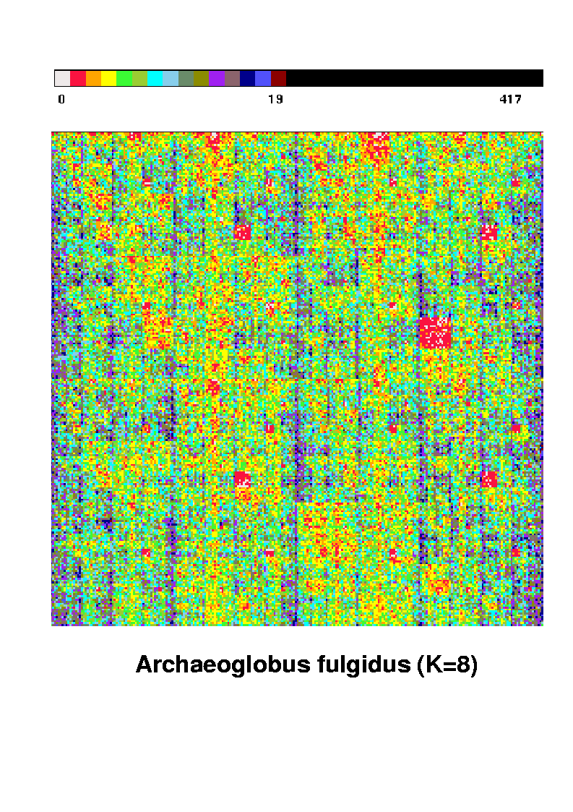
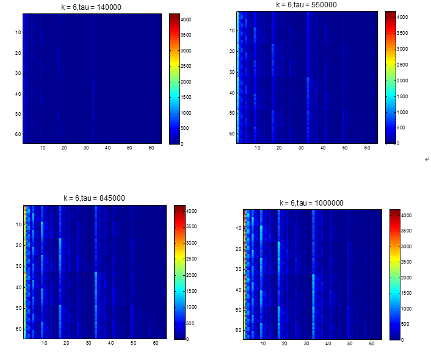

# 生物碱基序列分形绘图

### 题目：

画出一个随机产生的基因碱基序列中四个碱基A, G, T, 和C组成数量为k（k=3）的碱基链组合在其中的概率分步图，例如下图：



### 实现思路及步骤(Matlab实现)：

理论上，主要有两个困难，一是以四个碱基分布的概率去随机产生四个碱基之一，为便于整体的设计，用四进制的0,1,2,3分别代表四个碱基A,G,T,C,本报告采用利用rand()函数设计了新的函数RandHere()，具体调用方法是

```  RandGetted = RandHere(Pofbase)；                                                           ```

Pofbase是一个四维向量，为四个碱基的分布概率，返回值RandGetted为随机产生的碱基；实现思想是将rand()按照Pofbase划分区间。

​	二是碱基序列与图上位置的对应，为减少程序的时间复杂性和空间复杂性，本报告借助散列函数的思想，注意到这个问题实际上是四进制和二进制的相互转化，比如k=3时，TAG对应四进制数字为201，将其中每个数字用二进制表示，即为$(10)$，$(00)$和$(01)$, 则有：

$x = 1\times 2^2 + 0 \times 2+ 0\times 1+1, y = 0\times 2^2 + 0\times 2 + 1\times 1 +1$,  推广至 k=N, 有对于序列$b_1b_2\cdots b_N$, 翻译成四进制数字为$f_1f_2\cdots f_N$, $f_i(i=1,2,\cdots, N)$用二进制数字表示为$(a_1b_1), (a_2b_2), \cdots, (a_Nb_N)$, 则序列$b_1b_2\cdots b_N$对应的坐标$(x,y)$为下式：

​                        $x = a_1\times 2^{N-1} +  a_2\times 2^{N-2}+ \cdots + a_N\times 2^0 +1$ 

​                        $y = b_1\times 2^{N-1} +  b_2\times 2^{N-2}+ \cdots + b_N\times 2^0 +1$ 

具体调用函数如下:

```  [m,n] = BaseToPosition(BaseVector)；```

[m,n]为返回的坐标值，BaseVector为用四进制表示的碱基序列。

​       技术上，使用imagesc()函数进行绘图，并加了颜色条，进行了动画显示，主函数调用以如下方式调用：

``` draw(datasize, Pofbase, k);```

datasize为总序列规模，Pofbase为概率分布，k为序列长度。

### **结果表现：**

1.以k=6为例调用函数如下：

``` 
draw(1000000,[0.4,0.1,0.35,0.25],6);
```

结果如下：



2.以k=8，概率分布均匀得调用主函数如下：

``` 
draw(1000000,[0.25,0.25,0.25,0.25],8);
```

结果如下基本呈均匀分布：


3.以k=10，概率分布不均匀调用如下：

``` draw(2000000,[0.2,0.3,0.4,0.1],10);
draw(2000000,[0.2,0.3,0.4,0.1],10);
```

结果为：


### 代码：

draw.m

``` 
function draw(datasize,Pofbase,k)
%% draw the picture
%  using 0,1,2,3 to represent A,T,G and C 
% datasize为数据规模，Probase为四碱基概率，k为链长
% 图形展示方面有待使用GUI编程减小时间复杂性
% 如果是导入数据，程序只需简单修改
Dimension = sqrt(4^k);
Base = zeros(Dimension,Dimension);  %初始化矩阵
Basekeeper = zeros(1,k);  %用于输入转换函数
caxis_end = floor(max(Pofbase)^k*datasize)+1;
for j = 1:k
    Basekeeper(j) = RandHere(Pofbase);
end
[x0,y0] = BaseToPosition(Basekeeper);
figure
imagesc(Base);
caxis('manual')
colorbar;
drawnow;
tau = k;
title(sprintf('k = %1d,tau = %1d',k,tau),'Fontsize',14)
for i = 1:(datasize-k)
    
    Basekeeper(1:k-1) =  Basekeeper(2:k);
   
    Basekeeper(k) = RandHere(Pofbase);
    [x,y] = BaseToPosition(Basekeeper);
    Base(x,y) = Base(x,y) + 1;
    tau = tau  +1;
    if rem(i+k,10000)==0
        imagesc(Base);     
        caxis([0,caxis_end]);
        colorbar;
        title(sprintf('k = %1d,tau = %1d',k,tau),'Fontsize',14)
        drawnow;
    end
end
end
 
%% 概率产生函数分四碱基概率不同进行
function RandGetted = RandHere(Pofbase)
PofRange = Pofbase;
PofRange(2) = sum(Pofbase(1:2));
PofRange(3) = PofRange(2) + PofRange(3);
PofRange(4) = 1;
randN = rand;
if 0<randN &&randN<=PofRange(1)
             RandGetted = 0;
elseif PofRange(1)<randN &&randN<=PofRange(2)
             RandGetted = 1;
elseif PofRange(2)<randN &&randN<=PofRange(3)
             RandGetted = 2;
else 
             RandGetted = 3;
    end
end
 
%% 碱基到坐标的转换函数:本质上是四进制到二进制之间的转换
%通过单个坐标和碱基0,1,2,3数值进行比较发现可以用
% 二进制作为工具：比如k=3时，201,对应的二进制数为(1,0),(0,0)和(0,1)
% 则x = 1*2^2+0*2+0*1 +1,y = 0*2^2 + 0*2 +1*1+1;
function [m,n] = BaseToPosition(BaseVector)
k = length(BaseVector);
m = 1;n = 1;%初始位置
BaseTempVector = zeros(k,2);
for i =1:k
      BaseTempVector(i,1) = floor(BaseVector(i)/2);
      BaseTempVector(i,2) = rem(BaseVector(i),2);  
      
      BaseTempVector(i,1)=BaseTempVector(i,1)*2^(k-i);
      BaseTempVector(i,2) = BaseTempVector(i,2)*2^(k-i);    
end
m = m + sum(BaseTempVector(:,1));
n = n + sum(BaseTempVector(:,2));
%Position = [m,n];
end

```

