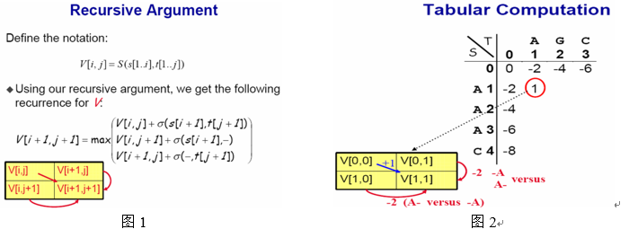
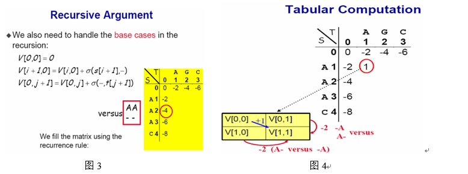
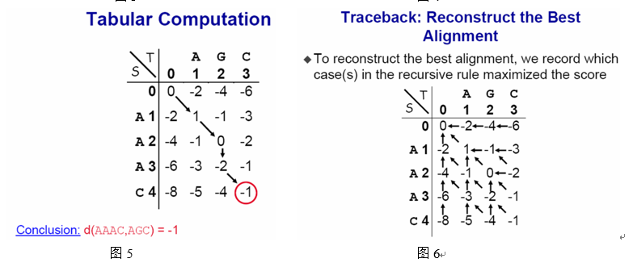
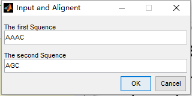
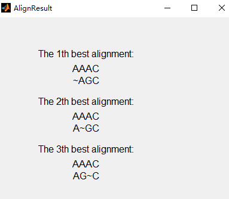
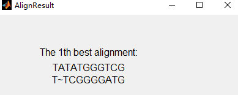

# 动态规划实现生物碱基序列全局匹配

### 问题

1. Find the best globe alignment of sequences TTCGGGGATG and TATATGGGTCG using daynamic programming.
2. Find the local alignments of sequences ATGGTTCCTTGGTA and GGAGTATATTTATGTAC using dynamic programming.

### 思路分析：

匹配的优劣主要有匹配的得分来衡量，如匹配正确‘GG’为1分，匹配错误如‘GC’为-1分，而一方缺失如‘G~’为-2分，‘~~’非法。总得分为最后匹配完成后所有碱基对的总和。

直接使用暴力搜索显然是时间复杂性不允许的，所以可以考虑使用动态规划法，而匹配的结果可能不止一个，这又涉及到图论中有向图两点间路径的遍历问题，可以考虑采用回溯法，数据结构方面，使用MATLAB结构体数组表示图，使用栈来实现回溯法。

而输入和结果输出方面使用简单的MATLAB图形界面编程即可，不必过分在意。

### **实现步骤：**

总函数为Align，可以将所有函数文件放在一个文件Align.m里，Align函数只要包含输入部分程序，然后调用GlobeAlignment和LocalAlignment函数即可。

​       GlobeAlignment的功能是实现碱基链的总体匹配，调用了下面四个函数：

```
Vmat = getStruct(Squence_1,Squence_2);
Vmat= globeStruct(Vmat,Squence_1,Squence_2);
[GlobeResult,Vmat] = globeSolve(Vmat);
printAlignResult(Vmat,GlobeResult);
```

其中，getStruct函数主要构建二维结构体数组，每个数组元素的结构体元素如下：

alignValue:分值，如x(1,1).alignValue = 1;

alignChar:匹配元素,类型为二维数组，如[A,C]；

maxDrec:可联通元素位置,初始为[],如对于第(1,1)个元素，maxDrec可能是[ ];

isGetted:是否访问过的记录，但不是只要访问过就改记录，而是出栈之后记录，而只要当连续入栈出栈时才依据其作判断。

globeStruct函数主要是对矩阵的前三个量进行赋值，alignValue和alignDrec的赋值规则及最优轨迹的寻找如下图1至图6所示：







GlobeSolve函数为核心程序，是在以上步骤完成后，进行的回溯法遍历起点到终点的轨迹，从而输出所有的最佳匹配。整个算法流程如下（以上图为例）：

1．栈内元素（坐标）为（1,1）（栈顶元素），（2,2），（3,3），（4,3），（5,4）；

2．（1,1）出栈，检查（2,2）点除（1,1）点外的可达点，没有则退栈；

3．现在栈顶为（3,3），再次退栈，栈顶为（4,3）；

4.（3,2）入栈，为栈顶，两可通点任选一个比如（2,2）入栈；

5.（1,1）入栈，输出整个栈，（1,1）再次出栈；

6.（2,1）入栈,(1,1)入栈，输出栈；

7.这一步很关键，（1,1），（1,2）出栈后，按照上述规则（2,2）又会入栈，这样不只是影响起点出栈和遍历结束，加入初始最优路径是（1,1），（2,1）,(3,2),(4,3),(5,4),则程序将反复在这两条轨迹之间遍历，不能遍历所以路径，所以这一步要加控制语句，即当紧接出栈后的入栈时，要检查一下准备入栈的元素的是否入过栈的记录，比如图中（2,1）出栈后，检查（2,2）已入过栈，则不再入栈，直接在退栈。这样做的依据是程序的递归性决定了某个访问过的分支起点（图中为（2,1））不可能再次访问。

​       其他部分程序思想较为简单，且程序中已有注释，不再解释。

​       由于LocalAlignment的思想与GlobeAligment类似，由于时间因素，没有实现。

### **结果表现：**

直接运行Align命令或者函数程序得到下面选择对话框：


选择GlobeAlignment，得到输入对话框，输入两个碱基链：



之后得到结果：



对于题目中的序列，得到如下结果：



所以这两个序列的最佳匹配唯一。

### **结果分析与程序反思：**

值得注意的是一般的回溯法的入栈和入栈时考虑不够周全，所以有可能不能全部遍历；在空间复杂性和时间复杂上，可能使用C语言、Java等会更加理想；代码的简洁性还可以提高。

### 代码：

##### Align.m

```
function Align
%author@Tiger Zhang
%To Find the best globe alignment of sequences
%Using dynamic programming 
%% function used:
%  GlobeAlignment(Squence_1,Squence_2)
% [GlobeResult,VmatNew] = globeSolve(Vmat)
% MatNew = cleanVector(Mat,Vec)
% printAlignValue(Vmat); 测试用
% printAlignResult(Vmat,ResultCell);
% VmatNew = globeStruct(Vmat,Squence_1,Squence_2)
% Vmat = getSturct(Squence_1,Squence_2)
% Score = fScore(Squence_1,Squence_2)
% score = fAlign(a,b)
% [char_a,char_b] = posiToChar(baseListPosi, j,Posi_a,Posi_b)

%% 输入部分：使用GUI进行输入
[Method_Select,isok]=listdlg('liststring',{'GlobeAlignment','LocalAlignment'},...  
    'listsize',[250 120],'OkString','OK','CancelString','Cancel',...  
    'promptstring','Alignment Method','name','Choose the Method', ...
    'selectionmode','multiple');  
%Method_Select = 'red';
Squence = inputdlg({'The first Squence','The second Squence'}, ...
    'Input and Alignent',[1 50;1 50]);
% options.position = [100 100 300 200];
Squence_1 = Squence{1};
Squence_2 = Squence{2};
if length(Squence_1) < length(Squence_2)
    Temp_squence = Squence_1;
    Squence_1 = Squence_2;
    Squence_2 = Temp_squence;
end
%% 动态规划匹配程序
if Method_Select == 2
    %LocalAlignment
      LocalAlignment(Squence_1,Squence_2);
else
     %GlobeAlignment
      GlobeAlignment(Squence_1,Squence_2);
end

%% 显示结果部分：
% h=waitbar(0,'开始绘图');
% pause(1); %延迟1秒
% ha=get(h,'children');
% hac=get(ha,'children');
% hapa=findall(hac,'type','patch');
% set(hapa,'Edgecolor','g','FaceColor','b');
% for i=1:100
%     
%     waitbar(i/100,h,['已完成' num2str(i) '%']);
%     pause(0.1);
% end

end
%------------------------------------------------------------------------------

function GlobeAlignment(Squence_1,Squence_2)
%% 说明(little long)：The Dynamic Programming consists of the
% following three essential components:
% 1.The recursive argument;
% 2.The tabular computation;
% 3.The traceback:reconstruct the best alignment
%     大体实现思路是根据字符串大小建立二维结构体矩阵，每个结构体包含两个元素，分别是：
% alignValue:分值，如x(1,1).alignValue = 1;
% alignChar:匹配元素,类型为二维数组，如[A,C]；
% maxDrec:可联通元素位置,初始为[],如对于第(1,1)个元素，maxDrec可能是[0,0;];
%     之后根据递归规则填充矩阵alignValue，直到完毕；然后是记录从终点回溯过程中
% 增加分值的联通路线，即改变maxDrec的值和维数；
%     最后从终点开始在可联通路线中遍历，相当于在一个三叉树中寻找两结点之间的路径。

%初始化规则：
% V[0,0] = 0;
% V[i+1,0] = V[i,0] + fAlign(s[i+1],-);
% V[0,i+1] = V[0,j] + fAlign(-,t[j+1]);
%   Squence_1 ='AAAG';%'TTCGGGGATG';%
%   Squence_2 ='ACG';% 'TATATGGGTCG';%
if length(Squence_1) <length(Squence_2)
    temp_s = Squence_2;
    Squence_2 = Squence_1;
    Squence_1 = temp_s;
end
Vmat = getStruct(Squence_1,Squence_2);
Vmat= globeStruct(Vmat,Squence_1,Squence_2);
[GlobeResult,Vmat] = globeSolve(Vmat);
printAlignResult(Vmat,GlobeResult);

end
%-------------------------------------------------------------------
function  LocalAlignment(Squence_1,Squence_2)
%% 局部匹配算法其实和全局匹配类似，这里直接省略了
t1 =sprintf('\tThe Local Alignment method is just similiar to the\n');
t2 = sprintf(' Globe Alignment Method,so I did not implement it.');
alignPrint=dialog('name','AlignResult','position', ...
    [300 300 620 200]','Resize','on');  
uicontrol('parent',alignPrint,'style','text','string',t1, ...
    'position',[10 130 600 25],'fontsize',15); 
uicontrol('parent',alignPrint,'style','text','string',t2, ...
    'position',[10 90 600 25],'fontsize',15); 
uicontrol('parent',alignPrint,'style','pushbutton','position',...  
   [260 30 40 25],'string','exit','callback','delete(gcbf)','fontsize',14);
end

%--------------------------------------------------------------------
function [GlobeResult,VmatNew] = globeSolve(Vmat)
%% 求解全局最佳匹配
%思路：在标记好可连通性后，采用有向图求两点间所有
%路径的回溯方法
[length_1,length_2] = size(Vmat);
for i = 1:length_1
    for j = 1:length_2
        Vmat(i,j).maxDrec = unique(Vmat(i,j).maxDrec,'rows');
    end
end
i = length_1;j = length_2;
%这部分将之前的那条路径可连通性赋予
GlobeResult = cell(1);
%% 以下是使用回溯法求解路径
% 要使用到栈，这里用一个可变维数的数组代替栈
%大体上先找到一条路线，打印栈，然后让重点出栈，这时看看栈顶元素有没有
% 通往其他点的路径，如果没有再出栈，如果有则入栈，直到到达终点
% （终点出栈前要打印栈）或者端点这时再让端点出栈，如此反复，直到栈为空
% 结束程序，这时所有的结果都已经找到了；
[a, b] = size(Vmat);
alignStack = [a, b];%初始栈为空；
%找到某条路径
while (b +a) > 2 %注意matlab的while时刻检查者变量大小
     while size(Vmat(a,b).maxDrec,1)==0
         alignStack(1,:) = [];
         a = alignStack(1,1);
         b = alignStack(1,2);
     end
    m = Vmat(a,b).maxDrec(1,1);
    n = Vmat(a,b).maxDrec(1,2);
    alignStack = [m, n; alignStack]; 
    a = m;
    b = n;
end
GlobeResult{1} = alignStack; %保存路径，最后输出
%% 开始回溯 
Temp = alignStack(1,:);
alignStack(1,:) =[];
i_1 = alignStack(1,1);
j_1 = alignStack(1,2);
Count = 1;
isOutInStack = 0;
while size(alignStack,1) > 1
    
    judgeVia = cleanVector(Vmat(i_1,j_1).maxDrec,Temp);
    if size(judgeVia,1) == 0
        Temp = alignStack(1,:);
        alignStack(1,:) = []; 
        Vmat(Temp(1),Temp(2)).isGetted = 0;
        isOutInStack =1;
        
    else
        if isOutInStack==0;
            alignStack = [judgeVia(1,:);alignStack];
        elseif isOutInStack == 1
            Temp = alignStack(1,:);
            length_ju = size(judgeVia,1);
            popCount = 0;
            for k = 1:length_ju
                if Vmat(judgeVia(k,1),judgeVia(k,2)).isGetted==1
                    alignStack = [judgeVia(k,:);alignStack];
                    popCount = 1;
                    isOutInStack = 0;
                end
            end
            if popCount ==0
                Temp = alignStack(1,:);
                alignStack(1,:) = []; 
                Vmat(Temp(1),Temp(2)).isGetted = 0;
                isOutInStack =1;
            end
        end
    end    
    i_1 = alignStack(1,1);
    j_1 = alignStack(1,2);
    
    if i_1==length_1&&length_2==j_1
        break;
    end
   
    if i_1 == 1&&j_1==1
        align_temp = GlobeResult{end};
        if Count==5
            break;
        end
        if Count >=2
            if sum(sum(align_temp-alignStack))==0;
                break;
            end
        end
            Count = Count +1;
            GlobeResult{Count} =alignStack; 
    end 
VmatNew = Vmat;
end
end
%------------------------------------------------------------------
function MatNew = cleanVector(Mat,Vec)
length_Mat = size(Mat,1);
   if length_Mat==0
       MatNew = [];
   else
       for i = 1:length_Mat
            if (Mat(length_Mat +1 - i,:) - Vec).^2==0
                Mat(length_Mat +1 - i,:) = [];
            end
       end
       MatNew = Mat;
   end
    
end
%-------------------------------------------------------------------
function printAlignResult(Vmat,ResultCell)
%% 打印输出结果 
lengthOfRes = length(ResultCell);
baseList_up = [];
baseList_down = [];
 %% 使用gui来表现结果
alignPrint=dialog('name','AlignResult','position', ...
    [300 200 400 500]','Resize','on');  
%options.Resize='on';
start_set = 430;

for i = 1:lengthOfRes
    baseListPosi = ResultCell{i};
    length_list = size(baseListPosi,1);
    for j = 1:length_list
        a = baseListPosi(j,1);
        b = baseListPosi(j,2);
        Posi_a = Vmat(a,b).alignChar(1);
        Posi_b = Vmat(a,b).alignChar(2);
        [char_a,char_b] = posiToChar(baseListPosi, j,Posi_a,Posi_b);
        baseList_up = [baseList_up,char_a];
        baseList_down = [baseList_down,char_b];
    end
    
t =  sprintf('The %dth best alignment:\n',i); 
uicontrol('parent',alignPrint,'style','text','string', ...
    t,'position',[50 start_set 200 20],'fontsize',12); 
uicontrol('parent',alignPrint,'style','text','string', ...
    baseList_up,'position',[50 start_set-25 200 20],'fontsize',12); 
uicontrol('parent',alignPrint,'style','text','string', ...
    baseList_down,'position',[50 start_set-45 200 20],'fontsize',12); 

start_set = start_set - 80;   
        
baseList_up = [];
baseList_down = [];
end
uicontrol('parent',alignPrint,'style','pushbutton','position',...  
   [80 10 50 20],'string','exit','callback','delete(gcbf)');

end

%--------------------------------------------------------
function [char_a,char_b] = posiToChar(baseListPosi, j,Posi_a,Posi_b)
    if j ==1
        char_a = '';
        char_b = '';
    elseif j > 1
            if baseListPosi(j,1) == baseListPosi(j-1,1)
                char_a = '~';
                char_b = Posi_b;
            elseif baseListPosi(j,2) == baseListPosi(j-1,2)                
                 char_a = Posi_a;
                 char_b = '~';
            else
                char_a = Posi_a;
                char_b = Posi_b;
            end
   
    end
end

%-----------------------------------------------------------------%

function printAlignValue(Vmat)
%% 打印结构体矩阵的alignValue
[length_1,length_2] = size(Vmat);
    for i = 1:length_1
        for j = 1:length_2
            fprintf('%d  ',Vmat(i,j).alignValue);
        end
        fprintf('\n');
    end
end

function VmatNew = globeStruct(Vmat,Squence_1,Squence_2)
%% GlobeAlignment时的矩阵赋值操作
Squence_1 = ['~',Squence_1];
Squence_2 = ['~',Squence_2];
[length_1,length_2] = size(Vmat);
%----边界赋值--------------------------------------------------
    for i = 1:length_1-1
            Vmat(i+1,1).alignValue = Vmat(i,1).alignValue + ...
                fAlign(Squence_1(i+1),Squence_2(1));
                Vmat(i+1,1).maxDrec = [i,1;Vmat(i+1,1).maxDrec];
    end
    for j = 1:length_2-1
            Vmat(1,j+1).alignValue = Vmat(1,j).alignValue + ...
                fAlign(Squence_1(1),Squence_2(j+1));
             Vmat(1,1+j).maxDrec = [1,j; Vmat(1,1+j).maxDrec];
    end
%----内部赋值-------------------------------------------------
% Vmat(length_1,length_2).alignValue = 1000;
i_temp = 2;j_temp =2;
Vmat(1,1).alignValue = 0;
Vmat(1,1).maxDrec = [];
    while i_temp<=length_1&&j_temp<=length_2
        Vmat = getValues(Vmat, i_temp, j_temp);
         for i = i_temp+1:length_1
            Vmat = getValues(Vmat, i, j_temp);
         end
         
         for j = j_temp+1:length_2
            Vmat = getValues(Vmat, i_temp, j);
         end        
         if j_temp == length_2-1&&i_temp < length_1
             i_temp  = i_temp +1;
         else
             if  i_temp <= length_1
                 i_temp = i_temp + 1;
             end
             if j_temp <= length_2 
                 j_temp = j_temp + 1;
             end
         end
         
         
    end
VmatNew = Vmat;
%% 
end

function VmatNew = getValues(Vmat, i, j)
    aValue = Vmat( i - 1, j - 1).alignValue +  ...
        fAlign(Vmat(i, j).alignChar(1),Vmat(i,j).alignChar(2));
    bValue  =  Vmat(i - 1, j).alignValue +  ...
        fAlign(Vmat(i, j).alignChar(1),'~');
    cValue  =  Vmat(i, j - 1).alignValue +  ...
        fAlign('~',Vmat(i, j).alignChar(2));
    AlignValue = max([aValue,bValue,cValue]);
    if aValue == AlignValue&&i - 1>0&&j -1>0
        Vmat(i,j).maxDrec = [i-1,j-1;Vmat(i,j).maxDrec];
    end
    if bValue == AlignValue&&i-1>0
        Vmat(i,j).maxDrec = [i-1,j;Vmat(i,j).maxDrec];
    end
    if cValue == AlignValue&&j-1>0
        Vmat(i,j).maxDrec = [i,j-1;Vmat(i,j).maxDrec];
    end
    
Vmat(i,j).alignValue = AlignValue;
VmatNew = Vmat;

end

function Vmat = getStruct(Squence_1,Squence_2)
%% 产生并初始化结构体
Squence_1 = ['~',Squence_1];
Squence_2 = ['~',Squence_2];
length_1 = length(Squence_1);
length_2 = length(Squence_2);    
    for i  = 1:length_1
        for j = 1:length_2
                Vmat(i,j).alignValue = 0;
                Vmat(i,j).alignChar = [Squence_1(i),Squence_2(j)];
                Vmat(i,j).maxDrec = [];
                Vmat(i,j).isGetted = 1;
        end
    end
end

function Score = fScore(Squence_1,Squence_2)
%% 计算两匹配模式总得分
lengthTwo = length(Squence_1);
Score = 0;
    for i = 1:lengthTwo
        Score = Score + fAlign(Squence_1(i),Squence_2(i));
    end
end

function  score = fAlign(a,b)
%% 用于计算单个碱基比对分数
    if a =='-'&&b =='~'
        error('Error:~ align ~ is  not allowed');
    elseif a=='~'||b=='~'
         score = -2;
    elseif a==b
         score = 1;
    else
         score = -1;
    end
end
```

